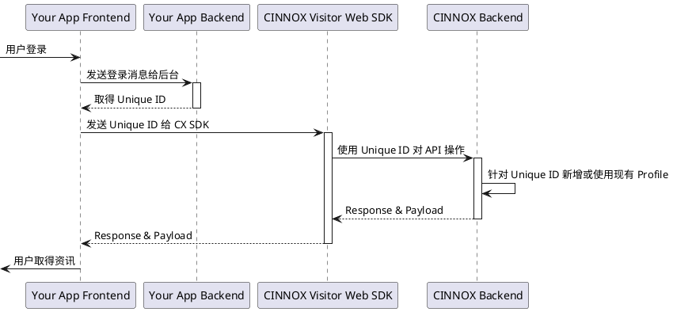

# 使用场景

CINNOX Visitor Web SDK 用于在您的网页应用中集成 CINNOX的访客（Visitor)服务，使您的客户可以进行多人聊天，也可以与您员工（Staff)进行咨询对话。包含了应用程序管理、认证服务、即时消息服务、会话服务、文件服务、通知服务等多个服务。以下基于 CINNOX Visitor Web SDK 的示例，API 接口文档可以参考附上的 html 文档。

## 先决条件

Visitor SDK 不包含 UI，需要您自行开发使用。另外如果需要集成 App 通知，请联系我们进行对接（support@cinnox.com)。
CINNOX Visitor Web SDK 需要与 CINNOX 主产品互动，如需注册或了解更多，请浏览 www.cinnox.com。

## 安装

目前提供 npm 安装，模块名称为 `cinnox-visitor-web-sdk`。

```bash
npm install cinnox-visitor-web-sdk
```

## 文档

[visitor-web-sdk 文档](https://cinnoxgithub.github.io/visitor-web-sdk/)

## 更新日志

[更新日志](https://github.com/CinnoxGitHub/visitor-web-sdk/blob/main/changelog.md)

## 基于 CINNOX Visitor Web SDK 的示例

### 初始化 CINNOX Visitor Web SDK

初始化 CINNOX Visitor Web SDK。

```js
import { initApp } from 'cinnox-visitor-web-sdk/app';

const onSdkLog = (log) => {
  const { time, level, namespace, message } = log;
  console.log(`[${time}] [${level}] [${namespace}] ${message}`);
};

// 测试环境范例 serviceName xxxxx.tb-01.cinnox.com
// 正式环境范例 serviceName xxxxx.cinnox.com
// deviceId 与推送相关，请使用相同 id
const initConfig = {
  deviceId,
  logLevel: LOG_LEVEL.INFO,
  name,
  onLog: onSdkLog,
  serviceName
};

initApp(initConfig).then((cxApp) => {
  console.log('CINNOX Visitor Web SDK 初始化完成')
  // 将 cxApp 写入 你的 App 全局变量 （ Vue 或 React ）
  app.config.globalProperties.$cxApp = cxApp
}).catch((error) => {
  console.error('CINNOX Visitor Web SDK 初始化失败:', error)
})

```

### 登入访客

CINNOX Visitor Web SDK，只提供简化的绑定功能，开发者需与您的后端用户服务进行绑定。这里 CINNOX Visitor Web SDK 只简单提供 login API。
需要注意的是，CINNOX Visitor Web SDK 不会存下 Auth 相关信息，所以需要 APP 开发者在每次 APP 开启时做 Login 操作。



```js
import { 
  generateNamedVisitorLoginPayload,
  login,
  getAuthService,
  updateCurrentUserProfile
} from 'cinnox-visitor-web-sdk/auth';
import { getNotification, startNotificationConnection } from 'cinnox-visitor-web-sdk/notification';
import { getInstantMessage, startInstantMessageConnection } from 'cinnox-visitor-web-sdk/instantMessage';

const visitorPayload = {
  email: 'EMAIL@DOMAIN',
  id: 'UNIQUE-ID',
};

const app = this.$cxApp;
const payload = generateNamedVisitorLoginPayload(visitorPayload);
const auth = getAuthService(app);
const loginResult = await login(auth, payload);

// 如果是注册，则需要做一次更新用户数据让 CINNOX 可以建立用户
// 请注意 __isSignup__ 是虚假的变数，需要开发者自行判断
if (__isSignup__) {
  // 产生 CINNOX 用户数据
  let contactPayload = {
    firstName: 'VISITOR FIRST NAME',
    lastName: 'VISITOR LAST NAME',
    icon: 'VISITOR ICON URL', // starts with https://
  };
  const updateResult = await updateCurrentUserProfile(auth, contactPayload);
}

// 因为通知/IM长连线需要在用户登入后才能启动，所以在这里启动长连线
// 这里的 Notification 不是离线推送，而是 CINNOX Visitor Web SDK 内部与服务器的连线
const notification = getNotification(app);
await startNotificationConnection(notification);
const im = getInstantMessage(app);
await startInstantMessageConnection(im);
```

### 取得所有客户公开群组聊天室

取得所有可以让用户进入的客户公开群组列表。

```js
import { getConversationService, queryPublicSpaceList } from 'cinnox-visitor-web-sdk/conversation';

const app = this.$cxApp;
const conversation = getConversationService(app);
const roomList = await queryPublicSpaceList(conversation);
```

### 取得目前用户已加入的最近聊天室列表

取得目前用户已加入的最近聊天室列表。

```js
import { getConversationService, queryCurrentUserRoomList } from 'cinnox-visitor-web-sdk/conversation';

const app = this.$cxApp;
const conversation = getConversationService(app);
const roomList = await queryCurrentUserRoomList(conversation);

// 因为系统设计考量，"咨询聊天室"的咨询结束后，聊天室不会移除访客，需要开发者自行过滤，避免显示没有咨询中的聊天室
const filterRoomList = roomList.filter((room) => {
  return !(room.type === 1001 && room.participants.length === 1);
});
```

### 加入客户公开群组聊天室

从客户公开群组聊天室列表中选择一个聊天室加入。

```js
import { getConversationService, joinSpace } from 'cinnox-visitor-web-sdk/conversation';

const app = this.$cxApp;
const conversation = getConversationService(app);
const room = await joinSpace(conversation, ROOM_ID);
```

### 聊天室内用户操作

#### 取得聊天室对话内容

```js
import { getConversationService, queryRoomHistory } from 'cinnox-visitor-web-sdk/conversation';

// 取得最后 30 笔消息
let payload = {
  roomId: ROOM_ID,
  limit: 30,
  sort: 'desc',
  start: '', // ISO 8601
  end: '', // ISO 8601
};

const app = this.$cxApp;
const conversation = getConversationService(app);
const roomHistory = await queryRoomHistory(conversation, payload);
```

#### 解除聊天室未读状态

```js
import { getInstantMessageService, sendMessageRead,  } from 'cinnox-visitor-web-sdk/im';
import { getConversationService, queryRoomHistory } from 'cinnox-visitor-web-sdk/conversation';

// ...
// 取得聊天室最新消息
const conversation = getConversationService(app);
const payload = {
  roomId: ROOM_ID,
  limit: 1,
  sort: 'desc',
};
const roomHistory = await queryRoomHistory(conversation, payload);
const latestMessage = roomHistory[0];
await sendMessageRead(im, { roomId: ROOM_ID, seq: latestMessage.seq, createdAt: latestMessage.createAt });
```

#### 发送消息至聊天室

```js
import { getInstantMessageService, generateTextMessagePayload, sendTextMessage } from 'cinnox-visitor-web-sdk/im';

let payload = generateTextMessagePayload({
  roomId: ROOM_ID,
  text: 'Hello World',
});

const app = this.$cxApp;
const im = getInstantMessageService(app);

const sendMessageResult = await sendTextMessage(im, payload);
```

#### 发送档案至聊天室

```js
    uploadImage() {
      console.log('上传图片按钮被点击')
      uni.chooseImage({
        count: 1,
        success: async (res) => {
          const app = getApp()
          const imSrv = getInstantMessageService(app)
          try {
            const fileInfo = await new Promise((resolve, reject) => {
              plus.io.resolveLocalFileSystemURL(res.tempFilePaths[0], (entry) => {
                entry.file(async (file) => {
                  const reader = new plus.io.FileReader();
                  reader.onloadend = function (evt) {
                    try {
                      const base64 = evt.target.result.split(',')[1];
                      const fileInfo = {
                        name: file.name,
                        size: file.size,
                        type: file.type,
                        base64: base64,
                      };

                      resolve(fileInfo);
                    } catch (error) {
                      console.log('error', error);
                    }
                  }

                  reader.readAsDataURL(file, 'utf-8');
                });
              });
            });

            const arrayBuffer = uni.base64ToArrayBuffer(fileInfo.base64);

            const md5 = await new Promise((resolve, reject) => {
              uni.getFileInfo({
                filePath: res.tempFilePaths[0],
                digestAlgorithm: 'md5',
                success: ({ digest }) => {
                  resolve(digest);
                }
              });
            });

            const payload = {
              fileList: [{ ...fileInfo, md5, arrayBuffer }],
              roomId: this.roomId,
            };

            try {
              const response = await sendFileMessage(imSrv, payload);
              console.log('response', response);
            } catch (error) {
              console.log('error', error);
            }
            this.closeUploadModal()
          } catch (error) {
            console.log('error1', error);
          }
        }
      })
    },
```

#### 发送语音消息至聊天室

```js
import { getInstantMessageService, sendAudioMessage } from 'cinnox-visitor-web-sdk/im';

let payload = {
  roomId: ROOM_ID,
  file: file,
};

const app = this.$cxApp;
const im = getInstantMessageService(app);

const sendMessageResult = await sendAudioMessage(im, payload);
```

#### 下载档案

```js
import { getFileService, downloadPrivateFile, getPrivateFileById } from 'cinnox-visitor-web-sdk/file';


const fileMsg = histories[xx];
const fileId = fileMsg.content.msg.file[0].id;
const app = this.$cxApp;
const fileService = getFileService(app);
const fileResp = await getPrivateFileById(fileService, fileId);
const fileDetail = fileResp.files[0];

const payload = {
  url: fileDetail.downloadUrl,
  headers: fileDetail.headers,
};
const fileResult = await downloadPrivateFile(fileService, payload);
```

### 创建咨询聊天室与Staff(企业员工)联系
```js
import { getConversationService, createOrQueryEnquiry } from '@cinnox-web/visitor-web-sdk/conversation';

let payload = {
  staff: STAFF_ID,
};

const app = this.$cxApp;
const conversation = getConversationService(app);
const enquiry = createOrQueryEnquiry(conversation, payload);
```

### 本地存储缓存

`启用本地存储缓存`可以让应用程序在下一次开启时，让部分模块在初始化过程中，可以取得暂存在本地存储空间里的资料，提供更快的使用体验。

目前支援存储缓存的功能如下:

* 联系人资料，目前支援 500 笔缓存。

#### 初始化本地存储缓存

请在应用程序初始化后，接著进行初始化存储空间缓存，让后续模块进行初始化时可以拿到缓存。

以下为使用 LocalStorage 的范例:

```js
import { initApp } from 'cinnox-visitor-web-sdk/app';
import { initStorageService, BasicStorage } from 'cinnox-visitor-web-sdk/storage';
import { initContactService } from 'cinnox-visitor-web-sdk/contact';

// 继承 BasicStorage 并实作 setItem 与 getItem 方法
class LocalStorageImpl extends BasicStorage {
  constructor() {
    super();
  }

  setItem(key, value) {
    // Web 端使用 localStorage
    localStorage.setItem(key, value);
    // Uniapp 端使用 uni.Storage
    uni.setStorageSync(key, value);
  }

  getItem(key) {
    // Web 端使用 localStorage
    return localStorage.getItem(key);
    // Uniapp 端使用 uni.Storage
    return uni.getStorageSync(key);
  }
}

const initConfig = {
  // ...
  // 请参阅初始化应用程序章节
};

const app = initApp(initConfig);
const localStorageImpl = new LocalStorageImpl();

// 初始化存储空间缓存
initStorageService(app, { storageInstance: localStorageImpl });

// 初始化联系人模组，让模组先取得缓存
initContactService(app);
```

## 数据描述

### 聊天室(Room)描述

#### 客户公开群组聊天室

供多个访客（Visitor)与员工（Staff）进行群组聊天的聊天室。

```js
import { ROOM_TYPE } from 'cinnox-visitor-web-sdk/conversation';

const roomData = {
  id: 'ROOM_ID',

  // 聊天室类型数据，群组聊天室为 2
  type: 2,

  icon: '',

  subject: "test_group_chat",

  participants: [],

  lastUpdatedMessage: {},
};

// 判断为客户公开群组聊天室
const isGroupRoom = roomData.type === ROOM_TYPE.EXTERNAL_SPACE;

// 聊天室识别 ID
const roomId = roomData.id;

// 聊天室名称
const roomTitle = roomData.subject;

// 聊天室成员数量
const roomParticipantsCount = roomData.participants.length;

// 聊天室图示资源网址，若值为空字串代表没有设定图示，请绘制自己的预设图示
const iconUrl = roomData.icon;

// 聊天室最后一则消息，若值为空物件代表没有消息
// 消息可以是文字、档案、音讯、系统消息等
// 可以参阅"聊天消息描述"章节，了解如何取得消息内容
const roomLastUpdatedMessage = roomData.lastUpdatedMessage;
```

#### 咨询聊天室

供一位访客（Visitor）与员工/客服（Staff)进行咨询的聊天室

```js
import { getContactService, getUserContactByEid } from 'cinnox-visitor-web-sdk/contact';
import { ROOM_TYPE } from 'cinnox-visitor-web-sdk/conversation';

const app = this.$cxApp;
const { eid: selfEid } = app.getIdToken();

const roomData = {
  id: 'ROOM_ID',

  // 聊天室类型数据，咨询聊天室为 1001
  type: 1001,

  icon: '',

  subject: "test_group_chat",

  participants: [],

  lastUpdatedMessage: {},

  inquiry: {},
};

// 判断为咨询聊天室
const isEnquiryRoom = roomData.type === ROOM_TYPE.ENQUIRY_ROOM;

// 聊天室识别 ID
const roomId = roomData.id;

// 聊天室名称
// 咨询聊天室没有固定名称，必须由使用者的角度决定
// 以下范例为显示负责咨询的客服名称
const contact = getContactService(app);
const targetHuntedAgentEid = roomData?.inquiry?.agent?.hunted?.staffTargets?.[0];
const targetHuntedAgentContact = await getUserContactByEid(contact, targetHuntedAgentEid);
const { firstName, lastName } = targetHuntedAgentContact;
const roomTitle = `${firstName} ${lastName}`;

// 聊天室成员数量
const roomParticipantsCount = roomData.participants.length;

// 聊天室图示，若值为空字串代表没有设定图示，请绘制自己的预设图示
const iconUrl = roomData.icon;

// 聊天室最后一则消息，若值为空物件代表没有消息
// 消息可以是文字、档案、音讯、系统消息等
// 可以参阅"聊天消息描述"章节，了解如何取得消息内容
const roomLastUpdatedMessage = roomData.lastUpdatedMessage;
```

### 聊天消息(Message History)描述

#### 文字消息

文字内容的消息

```js
import { HISTORY_TYPE, MESSAGE_CONTENT_TYPE } from 'cinnox-visitor-web-sdk/im';
import { getContactService, getUserContactByEid } from 'cinnox-visitor-web-sdk/contact';

const app = this.$cxApp;
const contactService = getContactService(app);

const messageData = {
  msgID: '',
  seq: 0,
  type: 'im',
  msgContentType: 'TYPE_TEXT',
  content: {
    from: {
      eid: 'senderEid',
    },
    msg: {
      text: 'Hello World',
    },
  },
  createdAt: "2025-02-18T08:41:43.441Z",
  isUpdated: false,
};

// 判断为文字消息
const isTextMessage = messageData.msgContentType === MESSAGE_CONTENT_TYPE.TYPE_TEXT;

// 取得文字内容
const textData = messageData.content.msg.text;

// 取得发送人资讯
const senderEid = messageData.content.from.eid;
const senderContact = await getUserContactByEid(contactService, senderEid);
const { firstName, lastName } = senderContact;
const senderName = `${firstName} ${lastName}`;

// 取得消息发送时间
const messageCreatedAt = messageData.createdAt;

// 取得消息是否曾经编辑过
const isMessageUpdated = messageData.isUpdated;

```

#### 档案消息

档案内容的消息，包含图像、视频、音讯与其他档案。

```js
import { HISTORY_TYPE, MESSAGE_CONTENT_TYPE, FILE_TYPE } from 'cinnox-visitor-web-sdk/im';
import { getContactService, getUserContactByEid } from 'cinnox-visitor-web-sdk/contact';

const app = this.$cxApp;
const contactService = getContactService(app);

const messageData = {
  msgID: {},
  seq: 0,
  type: 'im',
  msgContentType: 'TYPE_FILE',
  content: {
    from: {
      eid: 'senderEid',
    },
    msg: {
      file: [{
        downloadUrl: '',
        id: '',
        mimeType: '',
        name: '',
        size: 0,
        type: 1,
      }]
    },
  },
  createdAt: "2025-02-18T08:41:43.441Z",
  isUpdated: false,
};

// 判断档案消息
const isFileMessage = messageData.msgContentType === MESSAGE_CONTENT_TYPE.TYPE_FILE;

// 取得档案内容，显示图片、下载档案等等操作，请参阅 "下载档案" 章节
const fileData = messageData.content.msg.file[0];

// 判断档案类型
const isImageFile = fileData.type === FILE_TYPE.TYPE_IMAGE;
const isVideoFile = fileData.type === FILE_TYPE.TYPE_VIDEO;
const isOtherFile = fileData.type === FILE_TYPE.TYPE_OTHER;
const isAudioFile = fileData.type === FILE_TYPE.TYPE_AUDIO;

// 取得发送人资讯
const senderEid = messageData.content.from.eid;
const senderContact = await getUserContactByEid(contactService, senderEid);
const { firstName, lastName } = senderContact;
const senderName = `${firstName} ${lastName}`;

// 取得消息发送时间
const messageCreatedAt = messageData.createdAt;
```

#### 系统消息

显示系统事件的消息

```js
import { HISTORY_TYPE, SYSTEM_EVENT_TYPE } from 'cinnox-visitor-web-sdk/im';

const messageData = {
  msgID: {},
  seq: 0,
  type: 'system',
  eventKey: "room-event"
  eventType: "room.leave"
  createdAt: "2025-02-18T08:41:43.441Z",
  isUpdated: false,
  content: {
    removeBy: "",
    targets: [""],
  }
};

// 判断为系统消息
const isSystemMessage = messageData.type === HISTORY_TYPE.SYSTEM;

// 取得系统事件类型，此范例为成员离开事件，更多事件类型请参阅 api_docs 内的描述
const isRoomLeaveEvent = messageData.eventType === SYSTEM_EVENT_TYPE.ROOM_LEAVE;

// 取得系统事件发生时间
const messageCreatedAt = messageData.createdAt;

// 取得系统事件内容，此范例为成员离开事件。
const removeBy = messageData.content.removeBy;
const removeByContact = await getUserContactByEid(contactService, removeBy);
const removeTargetCount = messageData.content.targets.length;
const firstTarget = messageData.content.targets[0];
const targetContacts = await getUserContactByEid(contactService, firstTarget);

const { firstName, lastName } = removeByContact;
const removeByName = `${firstName} ${lastName}`;

const { firstName: targetFirstName, lastName: targetLastName } = targetContacts;
const targetName = `${targetFirstName} ${targetLastName}`;

const displayMessage = `${targetName} 等 ${removeTargetCount} 人已离开聊天室`;

const displayMessageWithRemoveBy = `${removeByName} 将 ${targetName} 等 ${removeTargetCount} 人移除聊天室`;
```

